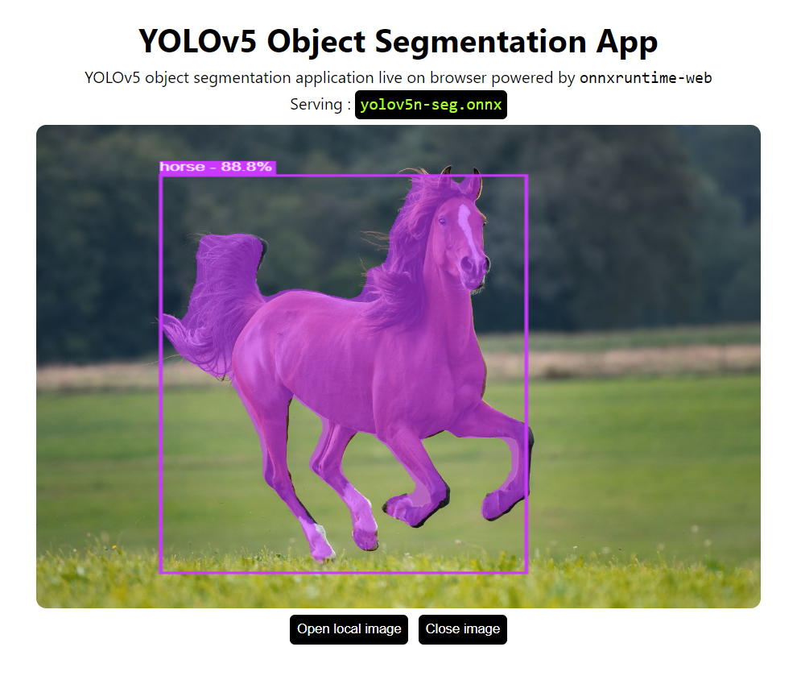

# YOLOv5 Segmentation with onnxruntime-web

<p align="center">
  
</p>


---

Object Segmentation application right in your browser.
Serving YOLOv5 segmentation in browser using onnxruntime-web with `wasm` backend.

## Setup

```bash
git clone https://github.com/Hyuto/yolov5-seg-onnxrumtime-web.git
cd yolov5-seg-onnxrumtime-web
yarn install # Install dependencies
```

## Scripts

```bash
yarn start # Start dev server
yarn build # Build for productions
```

## Known issue

1. Overlapped object doest fully rendered
